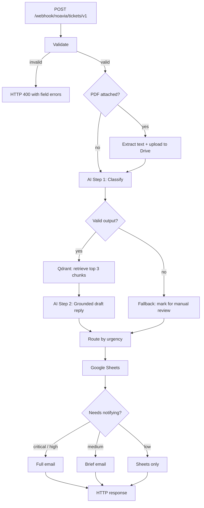

# NOAVIA Support Ticket AI

**A support inbox that reads itself.** Send it a customer ticket and it works out what
the ticket is about, how urgent it is, and writes your agent a draft reply grounded in
your own support documentation. Urgent things get emailed to your team. Everything gets
logged to a spreadsheet.

Built with n8n, OpenAI and Qdrant. Runs with one `docker compose up -d`.

---

## The problem this solves

Support inboxes are triage bottlenecks. Someone has to read every ticket, decide
whether it is on fire, look up the relevant policy, and write a reply. Most of that is
mechanical.

This automates the mechanical part and stops short of the part that needs a human. **It
never sends anything to your customer.** It writes a draft, tells your team how urgent
it is, and gets out of the way.

---

## What it looks like in practice

You POST a ticket:

```json
{
  "name": "Priya Raman",
  "email": "priya@example.com",
  "subject": "urgent",
  "message": "I cannot log into my account, the password reset fails and I am completely blocked."
}
```

Roughly eight seconds later, three things have happened.

**1. Your team gets an email**

```
NOAVIA ticket: TEST-2A4D8ED0BF
Category: account
Urgency: high
Confidence: 90%
Requester: Priya Raman <priya@example.com>

AI summary:
User is unable to log into their account due to a failed password reset.

Draft response:
Dear Priya Raman,

Thank you for reaching out regarding your login issue. I understand how
frustrating it is to be locked out, especially when the password reset is
not working as expected...

Knowledge sources: password-reset.md
```

**2. A row lands in Google Sheets** with 19 columns: the ticket, the classification,
the draft, which knowledge documents were used, the status, and a full processing log.

**3. The caller gets a response**

```json
{
  "ok": true,
  "data": {
    "ticket_id": "TEST-2A4D8ED0BF",
    "status": "routed",
    "urgency": "high",
    "email_sent": true
  }
}
```

If the customer had instead written *"thanks, the new dashboard looks great"*, it would
have been logged to Sheets and **no one would have been emailed**. Knowing when to stay
quiet is half the job.

### Attachments work too

Attach a PDF and the text gets extracted and read as part of the ticket. In testing, a
ticket whose entire body was *"Please see attached."* with an invoice PDF containing a
duplicate-charge complaint was correctly classified `billing` / `high`, because the
problem was described inside the document.

---

## How it works



**Step 1** asks OpenAI for a strict JSON object: category, urgency, sentiment,
confidence and a summary. The output is validated in four layers before anything trusts
it.

**Step 2** searches your knowledge base for the three most relevant passages, then asks
OpenAI to write a reply using only those passages, citing them. If nothing relevant is
found, the draft says so rather than inventing policy.

**Routing** follows urgency: critical and high get a full email, medium gets a brief
one, low is logged only. Anything the AI was less than 60% confident about is flagged
`needs-manual-review` no matter how urgent it looked.

Every external call degrades instead of failing. If OpenAI is down, if Qdrant is
unreachable, if the PDF is corrupt, if Gmail rejects the send, **the ticket still
reaches your spreadsheet** with the failure recorded. Losing a customer ticket is worse
than storing a degraded one.

---

## Quick start

You need Docker and an OpenAI API key.

```bash
git clone https://github.com/saiyudhaplhaomega/AI_Support_Ticket_System.git
cd AI_Support_Ticket_System
cp .env.example .env
docker compose up -d
```

Open http://localhost:5678 and create an n8n account when prompted.

| Service | URL |
|---|---|
| n8n | http://localhost:5678 |
| Qdrant dashboard | http://localhost:6333/dashboard |
| Frontend (optional) | http://localhost:8081 |

That gets the stack running. It cannot process a ticket yet, because n8n needs
credentials and the knowledge base needs indexing. That is the next section, and it
takes about ten minutes.

---

## Full setup

### 1. Create the credentials in n8n

Under **Settings → Credentials**, add these. **The names matter**, because the workflow
files look them up by name:

| Type | Name it exactly | Needed for |
|---|---|---|
| OpenAI | `OpenAI account` | Classification, drafting, embeddings |
| Qdrant | `Qdrant account` | Vector search. URL is `http://qdrant:6333` |
| Header Auth | `NOAVIA Ingest Header Auth` | Webhook authentication |
| Google Sheets OAuth2 | `Google Sheets account` | Ticket storage |
| Google Drive OAuth2 | any name | PDF upload |
| Gmail OAuth2 | any name | Internal notifications |

> The Qdrant URL is `http://qdrant:6333`, not `localhost:6333`. Containers talk to each
> other by service name.

Only OpenAI and Qdrant are required to see the AI pipeline work. Without the Google
credentials the pipeline still runs; the storage and email steps just fail gracefully.

### 2. Set the email recipient

The workflow reads its notification recipient from an environment variable, never from
the ticket itself. This is deliberate, so a malicious ticket cannot redirect your
internal mail.

Add this to `.env` before starting the stack:

```bash
NOAVIA_NOTIFY_ROUTE_ALLOWLIST_JSON={"default":"you@example.com","billing":"you@example.com","manual_review":"you@example.com"}
```

Skip this and emails silently go nowhere, because the recipient resolves to an empty
string.

### 3. Import the two workflows

In n8n, **Workflows → Import from File**, twice:

- `workflow/noavia/workflow.noavia-kb-ingestion.v1.json`
- `workflow/noavia/workflow.noavia-ticket-pipeline.v2.1.json`

Import them inactive. Open each one, click any node showing a credential warning, and
pick the credential you created. Then activate the ticket pipeline.

> **If you already have an older version imported, deactivate it first.** Both register
> the webhook path `noavia/tickets/v1`, and two active workflows on the same path will
> collide.

### 4. Index the knowledge base

Open the **ingestion** workflow and click **Execute Workflow**. It reads the nine
markdown files in `knowledge-base/noavia/`, splits them into 800-character chunks, turns
them into embeddings and stores them in Qdrant.

Check http://localhost:6333/dashboard. You should see a collection called
`noavia_kb_v1` with roughly 30 to 40 points.

> Run this **once**. It inserts rather than updates, so running it twice gives you
> duplicate chunks. Delete the collection first if you need to re-index.

### 5. Send your first ticket

```bash
curl -X POST "http://localhost:5678/webhook/noavia/tickets/v1" -H "X-NOAVIA-Webhook-Secret: your-secret-here" -H "Content-Type: application/json" -d '{"name":"Test User","email":"test@example.com","subject":"Cannot access my account","message":"I cannot log into my account, the password reset fails and I am completely blocked."}'
```

You should get back `{"ok":true,...}` with `"urgency":"high"`. Check the n8n executions
tab to watch it flow through every node.

### 6. Try it with a PDF

Generate the test files first:

```bash
pip install reportlab
python scripts/create_disputed_invoice_pdf.py
```

Then send one. The binary field **must** be named `data`:

```bash
curl -X POST "http://localhost:5678/webhook/noavia/tickets/v1" -H "X-NOAVIA-Webhook-Secret: your-secret-here" -F "name=Test User" -F "email=test@example.com" -F "subject=Invoice" -F "message=Please see attached." -F "data=@output/pdf/noavia-disputed-invoice.pdf;type=application/pdf"
```

---

## Deploying to a server

The same Compose stack runs on any VPS. Two vCPU and 4 GB RAM is comfortable. What
changes is TLS and exposure.

**1. Install Docker and clone the repo**

```bash
curl -fsSL https://get.docker.com | sh
git clone https://github.com/saiyudhaplhaomega/AI_Support_Ticket_System.git
cd AI_Support_Ticket_System && cp .env.example .env
```

**2. Point n8n at your domain.** n8n builds webhook and OAuth callback URLs from these,
so they have to match your real hostname:

```yaml
environment:
  N8N_HOST: n8n.example.com
  N8N_PROTOCOL: https
  WEBHOOK_URL: https://n8n.example.com/
```

**3. Put a reverse proxy in front.** Do not expose port 5678 directly. Caddy is the
shortest path since it handles certificates automatically:

```caddyfile
n8n.example.com {
    reverse_proxy n8n:5678
}
```

nginx with certbot works just as well.

**4. Lock it down.** This matters more than the rest:

- **Remove Qdrant's `ports:` mapping.** It has no authentication by default. Nothing
  outside the Compose network needs to reach it.
- Remove n8n's `ports:` mapping too, so the proxy is the only way in.
- Turn on n8n owner authentication at first launch.
- Keep the webhook header auth credential. The proxy should not be your only gate.
- Firewall everything except 80 and 443.

**5. Start it and follow steps 1 to 5 above.** The only difference is the URL:

```bash
curl -X POST "https://n8n.example.com/webhook/noavia/tickets/v1" -H "X-NOAVIA-Webhook-Secret: $SECRET" -H "Content-Type: application/json" -d '{"name":"Test User","email":"test@example.com","subject":"urgent","message":"I cannot log into my account."}'
```

### Changing the workflow

The tracked JSON is **generated**, not hand-written. Edit the generator, not the file:

```bash
python scripts/build_part1_workflow.py
python scripts/verify_part1_workflows.py
```

Then re-import, remembering to deactivate the old version first.

---

## Where everything lives

| Folder | What is in it |
|---|---|
| [`workflow/noavia/`](workflow/noavia/) | The n8n workflow files. **This is the important one.** |
| [`knowledge-base/noavia/`](knowledge-base/noavia/) | The nine support documents the AI quotes from |
| [`scripts/`](scripts/) | Workflow generator, verifier, and PDF test fixtures |
| [`evals/`](evals/) | Retrieval testing that calibrated the similarity threshold |
| [`tests/`](tests/) | Structural tests for the workflow files |
| [`docs/`](docs/) | Design notes. Much of it is historical, see its README |
| [`services/`](services/) | Optional web frontend, plus a retired microservice |

Every folder has its own README explaining what is inside.

Gitignored and not part of the project: `.hermes/`, `.worktrees/`, `output/`, `tmp/`,
`interview-prep/`, `archive/`.

---

## Design notes

Why it is built this way, how the AI output is validated and why that shape, the RAG
chunking and embedding choices, and what I would do next:

- [Design rationale](docs/design-rationale.md), one page
- [Workflow walkthrough](docs/workflow-walkthrough.md), every node in both workflows

---

## Security

- `.env` is gitignored. Only `.env.example` is tracked and it has no values in it.
- The workflow files reference credentials **by n8n credential ID**, so no keys are
  embedded in them.
- `.hermes/` is gitignored and should stay that way. Raw n8n execution logs capture full
  HTTP request headers, which include `Authorization: Bearer` tokens.

---

## Known limitations

Written down rather than hidden:

1. Knowledge base ingestion inserts instead of updating, so re-running it duplicates
   chunks.
2. No reranking step, so the third retrieved document is sometimes only loosely related.
3. Nothing checks that the draft's claims are actually supported by the retrieved
   passages.
4. n8n's OpenAI node silently drops the `response_format` parameter, so the parser
   strips markdown code fences defensively instead of relying on JSON mode.
5. The brief email leaves out processing warnings. They are still recorded in the
   spreadsheet.
6. No load testing, and no spending cap per ticket.

---

## Verify your setup

```bash
python scripts/verify_part1_workflows.py
docker compose config --quiet
```

The first checks that every workflow file still has its required nodes, validation
logic, routing thresholds, and matching embedding dimensions between indexing and
search. The second confirms the Compose file is valid.
