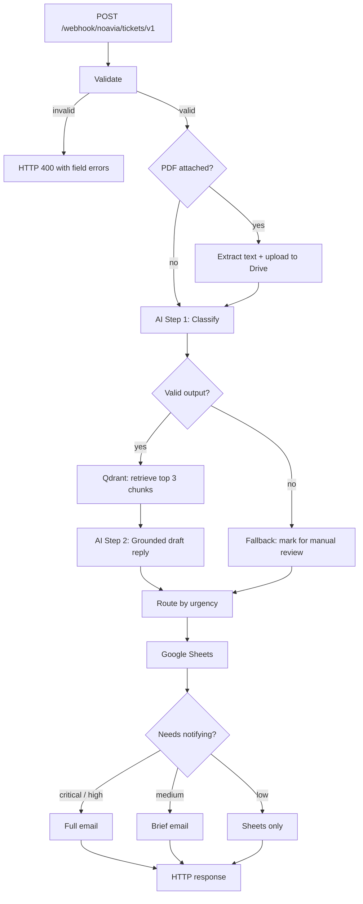

# AI Support Ticket System

**A support desk that reads itself.** Send it a customer ticket and it works out what
the ticket is about, how urgent it is, and writes your agent a draft reply grounded in
your own documentation. Urgent things get emailed to your team. Everything gets logged
to a spreadsheet.

Alongside the ticket pipeline it ships two RAG chatbots, a document management layer,
and a web frontend. Built on n8n, OpenAI, MiniMax and Qdrant. Runs with one
`docker compose up -d`.

---

## What is in the box

| Component | What it does |
|---|---|
| **Ticket pipeline** | Classifies incoming tickets, retrieves relevant policy, drafts a reply, routes by urgency to Sheets and email |
| **Public chat assistant** | RAG chatbot for customers. Answers from a public knowledge base only, so it cannot leak internal docs |
| **Admin chat assistant** | RAG chatbot for staff, answering from the internal knowledge base |
| **Knowledge ingestion** | Chunks, embeds and indexes markdown into Qdrant |
| **Document manager** | Add, version and retire knowledge documents through an API, with the source text kept in a data table and Qdrant treated as a derived index |
| **Knowledge and source libraries** | Read APIs for listing and inspecting indexed documents |
| **Web frontend** | Flask app serving the ticket form, the public chat and the admin assistant |

Three separate Qdrant collections keep the corpora apart: `noavia_kb_v1` for support,
`noavia_public_chat_kb_v1` for customer-facing chat, `noavia_admin_kb_v1` for staff.
The separation is deliberate. A public chatbot that can retrieve internal
documentation is a data leak waiting to happen.

---

## The problem this solves

Support inboxes are triage bottlenecks. Someone has to read every ticket, decide
whether it is on fire, look up the relevant policy, and write a reply. Most of that is
mechanical.

This automates the mechanical part and stops at the part that needs a human. **It never
sends anything to your customer.** It writes a draft, tells your team how urgent it is,
and gets out of the way.

---

## What it looks like in practice

You POST a ticket:

```json
{
  "name": "Priya Raman",
  "email": "priya@example.com",
  "subject": "urgent",
  "message": "I cannot log into my account, the password reset fails and I am completely blocked."
}
```

Roughly eight seconds later, three things have happened.

**1. Your team gets an email**

```
Ticket: TEST-2A4D8ED0BF
Category: account
Urgency: high
Confidence: 90%
Requester: Priya Raman <priya@example.com>

AI summary:
User is unable to log into their account due to a failed password reset.

Draft response:
Dear Priya Raman,

Thank you for reaching out regarding your login issue. I understand how
frustrating it is to be locked out, especially when the password reset is
not working as expected...

Knowledge sources: password-reset.md
```

**2. A row lands in Google Sheets** with 19 columns: the ticket, the classification,
the draft, which documents were used, the status, and a full processing log.

**3. The caller gets a response**

```json
{
  "ok": true,
  "data": {
    "ticket_id": "TEST-2A4D8ED0BF",
    "status": "routed",
    "urgency": "high",
    "email_sent": true
  }
}
```

Had the customer written *"thanks, the new dashboard looks great"*, it would have been
logged to Sheets and **nobody would have been emailed**. Knowing when to stay quiet is
half the job.

**Attachments work too.** Attach a PDF and its text is extracted and read as part of
the ticket. In testing, a ticket whose entire body was *"Please see attached."* with an
invoice PDF containing a duplicate-charge complaint was correctly classified
`billing` / `high`, because the problem was described inside the document.

---

## How the ticket pipeline works



**Step 1** asks OpenAI for a strict JSON object: category, urgency, sentiment,
confidence and a summary. It is validated in four layers before anything trusts it.

**Step 2** searches the knowledge base for the three most relevant passages, then asks
OpenAI to write a reply using only those passages, citing them. If nothing relevant is
found, the draft says so rather than inventing policy.

**Routing** follows urgency: critical and high get a full email, medium a brief one,
low is logged only. Anything the AI was less than 60% confident about is flagged
`needs-manual-review` regardless of urgency.

Every external call degrades instead of failing. If OpenAI is down, if Qdrant is
unreachable, if the PDF is corrupt, if Gmail rejects the send, **the ticket still
reaches your spreadsheet** with the failure recorded. Losing a customer ticket is worse
than storing a degraded one.

---

## Quick start

You need Docker and an OpenAI API key.

```bash
git clone https://github.com/saiyudhaplhaomega/AI_Support_Ticket_System.git
cd AI_Support_Ticket_System
cp .env.example .env
docker compose up -d
```

Open http://localhost:5678 and create an n8n account when prompted.

| Service | URL |
|---|---|
| n8n | http://localhost:5678 |
| Qdrant dashboard | http://localhost:6333/dashboard |
| Frontend | http://localhost:8081 |

That starts the stack. It cannot process a ticket yet, because n8n needs credentials
and the knowledge base needs indexing. That takes about ten minutes.

---

## Full setup

### 1. Create the credentials in n8n

Under **Settings → Credentials**. **The names matter**, because the workflow files look
them up by name:

| Type | Name it exactly | Needed for |
|---|---|---|
| OpenAI | `OpenAI account` | Classification, drafting, embeddings |
| Qdrant | `Qdrant account` | Vector search. URL is `http://qdrant:6333` |
| Header Auth | `NOAVIA Ingest Header Auth` | Webhook authentication |
| Google Sheets OAuth2 | `Google Sheets account` | Ticket storage |
| Google Drive OAuth2 | any name | PDF upload |
| Gmail OAuth2 | any name | Internal notifications |
| MiniMax | `MiniMax account` | Public and admin chat assistants only |

> The Qdrant URL is `http://qdrant:6333`, not `localhost:6333`. Containers reach each
> other by service name.

Only OpenAI and Qdrant are required for the ticket pipeline. Without the Google
credentials it still runs; storage and email just fail gracefully. MiniMax is only
needed if you want the chat assistants.

### 2. Set the email recipient

The pipeline reads its notification recipient from an environment variable, never from
the ticket. This is deliberate, so a malicious ticket cannot redirect internal mail.

Add to `.env` before starting:

```bash
NOAVIA_NOTIFY_ROUTE_ALLOWLIST_JSON={"default":"you@example.com","billing":"you@example.com","manual_review":"you@example.com"}
```

Skip it and emails silently go nowhere, because the recipient resolves to empty.

### 3. Import the workflows

In n8n, **Workflows → Import from File**. At minimum:

- `workflow/noavia/workflow.noavia-kb-ingestion.v1.json`
- `workflow/noavia/workflow.noavia-ticket-pipeline.v2.1.json`

For the chat assistants and document management, also import the public chat, admin
chat, document manager and library workflows from the same folder. See
[`workflow/noavia/README.md`](workflow/noavia/README.md) for what each one does.

Import inactive, bind credentials on any node showing a warning, then activate.

> **Deactivate any older ticket pipeline first.** Both register the webhook path
> `noavia/tickets/v1`, and two active workflows on one path will collide.

### 4. Index the knowledge base

Open the **ingestion** workflow and click **Execute Workflow**. It reads the nine
markdown files in `knowledge-base/noavia/`, splits them into 800-character chunks,
embeds them and stores them in Qdrant.

Check http://localhost:6333/dashboard for a `noavia_kb_v1` collection with roughly 30
to 40 points.

> Run this **once**. It inserts rather than updates, so a second run gives you duplicate
> chunks. Delete the collection first if you need to re-index.

### 5. Send your first ticket

```bash
curl -X POST "http://localhost:5678/webhook/noavia/tickets/v1" -H "X-NOAVIA-Webhook-Secret: your-secret-here" -H "Content-Type: application/json" -d '{"name":"Test User","email":"test@example.com","subject":"Cannot access my account","message":"I cannot log into my account, the password reset fails and I am completely blocked."}'
```

You should get `{"ok":true,...}` with `"urgency":"high"`. Watch it flow through every
node in the n8n executions tab.

### 6. Try it with a PDF

```bash
pip install reportlab
python scripts/create_disputed_invoice_pdf.py
```

The binary field **must** be named `data`:

```bash
curl -X POST "http://localhost:5678/webhook/noavia/tickets/v1" -H "X-NOAVIA-Webhook-Secret: your-secret-here" -F "name=Test User" -F "email=test@example.com" -F "subject=Invoice" -F "message=Please see attached." -F "data=@output/pdf/noavia-disputed-invoice.pdf;type=application/pdf"
```

---

## Deploying to a server

The same Compose stack runs on any VPS. Two vCPU and 4 GB RAM is comfortable. What
changes is TLS and exposure.

**1. Install Docker and clone**

```bash
curl -fsSL https://get.docker.com | sh
git clone https://github.com/saiyudhaplhaomega/AI_Support_Ticket_System.git
cd AI_Support_Ticket_System && cp .env.example .env
```

**2. Point n8n at your domain.** It builds webhook and OAuth callback URLs from these,
so they must match the real hostname:

```yaml
environment:
  N8N_HOST: n8n.example.com
  N8N_PROTOCOL: https
  WEBHOOK_URL: https://n8n.example.com/
```

**3. Put a reverse proxy in front.** Do not expose port 5678 directly. Caddy is the
shortest path since it handles certificates automatically:

```caddyfile
n8n.example.com {
    reverse_proxy n8n:5678
}
```

nginx with certbot works equally well.

**4. Lock it down.** This matters more than the rest:

- **Remove Qdrant's `ports:` mapping.** It has no authentication by default and nothing
  outside the Compose network needs to reach it.
- Remove n8n's `ports:` mapping too, so the proxy is the only way in.
- Enable n8n owner authentication at first launch.
- Keep the webhook header auth credential. The proxy should not be your only gate.
- Firewall everything except 80 and 443.

**5. Start it and follow steps 1 to 5 above.** Only the URL changes:

```bash
curl -X POST "https://n8n.example.com/webhook/noavia/tickets/v1" -H "X-NOAVIA-Webhook-Secret: $SECRET" -H "Content-Type: application/json" -d '{"name":"Test User","email":"test@example.com","subject":"urgent","message":"I cannot log into my account."}'
```

### Changing the ticket workflow

The tracked JSON is **generated**, not hand-written. Edit the generator, not the file:

```bash
python scripts/build_workflow.py
python scripts/verify_workflows.py
```

Then re-import, deactivating the old version first.

---

## API endpoints

| Path | Method | Purpose |
|---|---|---|
| `/webhook/noavia/tickets/v1` | POST | Submit a support ticket |
| `/webhook/noavia/public-chat/v1` | POST | Customer-facing RAG chat |
| `/webhook/noavia/admin-chat/v1` | POST | Staff-facing RAG chat |
| `/webhook/noavia/documents/v1` | POST | Add, update or retire a knowledge document |
| `/webhook/noavia/kb/update/v1` | POST | Upload a document straight into the index |
| `/webhook/noavia/kb/library/v1` | POST | List and inspect indexed chunks |
| `/webhook/noavia/source-library/v1` | POST | List canonical source documents |

All are header-authenticated.

---

## Where everything lives

| Folder | What is in it |
|---|---|
| [`workflow/noavia/`](workflow/noavia/) | All n8n workflow files. **The core of the project.** |
| [`knowledge-base/`](knowledge-base/) | The markdown documents the assistants quote from |
| [`scripts/`](scripts/) | Workflow generator, verifier, PDF test fixtures |
| [`evals/`](evals/) | Retrieval testing that calibrated the similarity threshold |
| [`tests/`](tests/) | Structural tests for the workflow files |
| [`docs/`](docs/) | Design notes and reference material |
| [`services/`](services/) | Web frontend, plus a retired classification microservice |

Every folder has its own README.

---

## Design notes

- [Design rationale](docs/design-rationale.md), one page: architecture decisions, how
  AI output is validated and why, RAG chunking and embedding choices, what to improve
- [Workflow walkthrough](docs/workflow-walkthrough.md): every node in the ticket
  pipeline and knowledge ingestion

---

## Security

- `.env` is gitignored. Only `.env.example` is tracked and it holds no values.
- Workflow files reference credentials **by n8n credential ID**, so no keys are embedded.
- Raw n8n execution logs capture full HTTP request headers including
  `Authorization: Bearer` tokens. Never commit them.
- The public chat assistant reads a separate Qdrant collection from the internal one, so
  it cannot retrieve staff documentation.

---

## Known limitations

Written down rather than hidden:

1. Knowledge ingestion inserts instead of updating, so re-running duplicates chunks.
2. No reranking step, so the third retrieved document is sometimes only loosely related.
3. Nothing verifies the draft's claims are actually supported by the retrieved passages.
4. n8n's OpenAI node silently drops the `response_format` parameter, so the parser
   strips markdown code fences defensively instead of relying on JSON mode.
5. The brief email omits processing warnings. They are still recorded in the spreadsheet.
6. No load testing, and no per-ticket spending cap.

---

## Verify your setup

```bash
python scripts/verify_workflows.py
docker compose config --quiet
```

The first checks every workflow file still has its required nodes, validation logic,
routing thresholds, and matching embedding dimensions between indexing and search.
